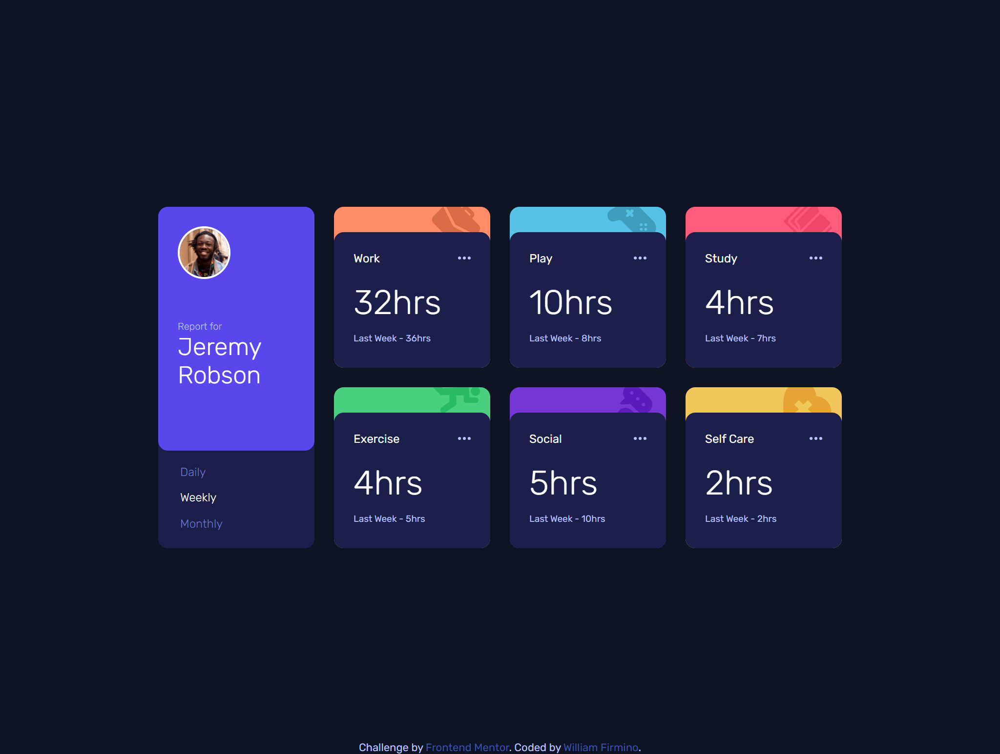
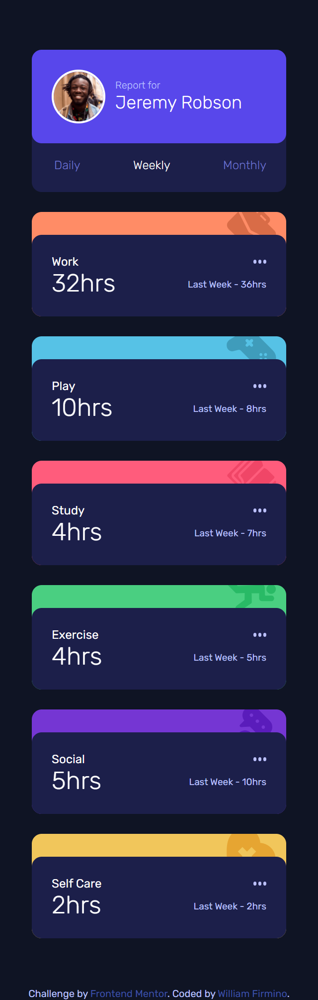

# Frontend Mentor - Time tracking dashboard solution

This is a solution to the [Time tracking dashboard challenge on Frontend Mentor](https://www.frontendmentor.io/challenges/time-tracking-dashboard-UIQ7167Jw). Frontend Mentor challenges help you improve your coding skills by building realistic projects.

## Table of contents

- [Overview](#overview)
  - [The challenge](#the-challenge)
  - [Screenshot](#screenshot)
  - [Links](#links)
- [My process](#my-process)
  - [Built with](#built-with)
  - [What I learned](#what-i-learned)
  - [Continued development](#continued-development)
- [Author](#author)

## Overview

### The challenge

Users should be able to:

- View the optimal layout for the site depending on their device's screen size
- See hover states for all interactive elements on the page
- Switch between viewing Daily, Weekly, and Monthly stats

### Screenshots

> Desktop Preview
> 

> Active States on Hover
> 

> Mobile preview
> 

### Links

- Solution URL: [Add solution URL here](https://your-solution-url.com)
- Live Site URL: [Add live site URL here](https://your-live-site-url.com)

## My process

### Built with

- Semantic HTML5 markup
- CSS custom properties
- Flexbox
- CSS Grid
- Javascript
- Fetch API
- Media Queries

### What I learned

I could recap a lot of things building this one and I fell excited moving forward for more challenges. I didn't use mobile-first design principles but I was able to realize some things to start with it in my next project. I haven't used anything but pure HTML, CSS and JavaScript and it made me feel like I could make it faster if I have used frameworks. Perhaps now I can finally start to grow my knowledge about them.

### Continued development

Now I plan to start using mobile-first design principles as well creating pages with react.

## Author

- Github - [William Firmino](https://github.com/Willwf)
- Frontend Mentor - [@Willwf](https://www.frontendmentor.io/profile/Willwf)
- Twitter - [@Williamwf](https://www.twitter.com/Williamwf)
- LinkedIn - [William Firmino](https://www.linkedin.com/in/williamfirmino/)
